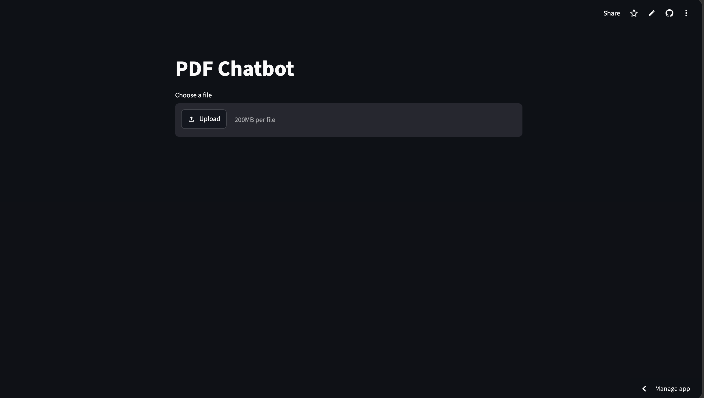
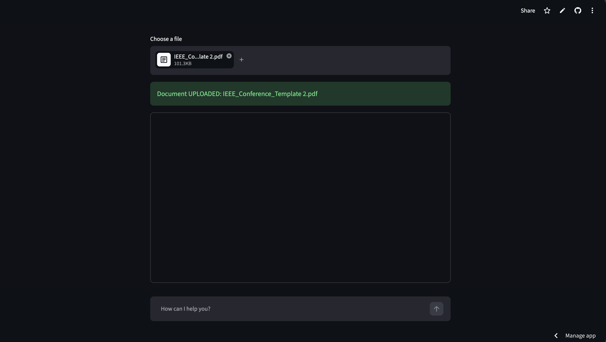
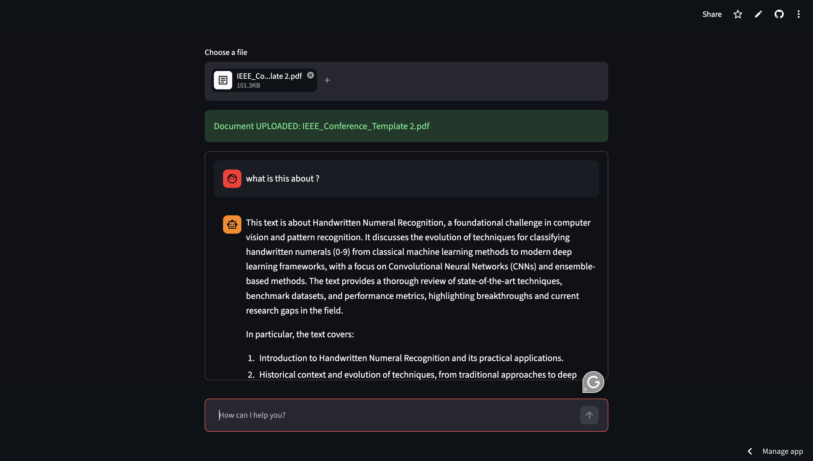

# 🤖 PDFchatBot

A conversational AI chatbot that lets you **upload any PDF** and instantly ask questions about its content — powered by **Groq's LLaMA 3.3 70B** model and built with **Streamlit**.

🔗 **Live Demo:** [pdfchatbot-joel.streamlit.app](https://pdfchatbot-joel.streamlit.app/)

---

## 📸 Screenshots

### Home Screen — Upload your PDF


### PDF Uploaded Successfully


### Chat in Action


---

## ✨ Features

- 📄 **Upload any PDF** directly through the browser UI (up to 200MB)
- ✅ **Upload confirmation** banner shows the filename once processed
- 💬 **Chat interface** to ask natural language questions about your document
- 🧠 **LLaMA 3.3 70B** (via Groq API) for fast, accurate, context-aware responses
- 🔒 Answers are **grounded in the PDF content** — out-of-scope questions are gracefully declined
- ⚡ **Streamlit-powered** for a clean, interactive web UI

---

## 🛠️ Tech Stack

| Component | Technology |
|-----------|------------|
| UI Framework | [Streamlit](https://streamlit.io/) |
| LLM Provider | [Groq](https://groq.com/) (LLaMA 3.3 70B Versatile) |
| PDF Parsing | [PyMuPDF (`fitz`)](https://pymupdf.readthedocs.io/) |
| Language | Python 3.x |

---

## 📦 Installation

### 1. Clone the repository

```bash
git clone https://github.com/18Joel/PDFchatBot.git
cd PDFchatBot
```

### 2. Install dependencies

```bash
pip install -r requirements.txt
```

### 3. Set your Groq API Key

Get your free API key from [console.groq.com](https://console.groq.com/) and set it as an environment variable:

```bash
# Linux / macOS
export GROQ_API_KEY="your_api_key_here"

# Windows (Command Prompt)
set GROQ_API_KEY=your_api_key_here

# Windows (PowerShell)
$env:GROQ_API_KEY="your_api_key_here"
```

### 4. Run the app

```bash
streamlit run main.py
```

The app will open in your browser at `http://localhost:8501`.

---

## 🚀 Usage

1. **Upload a PDF** using the file uploader on the main page.
2. Wait for the green **"Document UPLOADED"** confirmation banner.
3. **Type your question** in the chat input box at the bottom.
4. The bot will answer based **only on the content of the uploaded PDF**.
5. If your question is unrelated to the document, the bot will respond with *"I don't know."*

---

## 📁 Project Structure

```
PDFchatBot/
├── main.py            # Main Streamlit application
├── requirements.txt   # Python dependencies
└── uploads/           # Auto-created folder for uploaded PDFs (gitignored)
```

---

## 📋 Requirements

```
requests
numpy
streamlit
groq
pymupdf
```

Install all at once with:

```bash
pip install -r requirements.txt
```

---

## ⚙️ How It Works

1. The user uploads a PDF via Streamlit's `file_uploader`.
2. The file is saved locally to an `uploads/` directory.
3. **PyMuPDF (`fitz`)** extracts all text from the PDF pages.
4. When the user submits a question, both the extracted text and the question are sent to the **Groq API** as a prompt.
5. The LLaMA 3.3 70B model returns a contextual answer based solely on the document content.
6. The response is displayed in Streamlit's chat message UI.

---

## 🔑 Environment Variables

| Variable | Description |
|----------|-------------|
| `GROQ_API_KEY` | Your Groq API key (required) |

---

## 🤝 Contributing

Contributions are welcome! Feel free to open an issue or submit a pull request.

1. Fork the project
2. Create your feature branch (`git checkout -b feature/AmazingFeature`)
3. Commit your changes (`git commit -m 'Add some AmazingFeature'`)
4. Push to the branch (`git push origin feature/AmazingFeature`)
5. Open a Pull Request

---

## 👨‍💻 Author

**Joel Joseph** — [@18Joel](https://github.com/18Joel)

---

## 📄 License

This project is open source and available under the [MIT License](LICENSE).
